# employee-crud
A demo Server for Employee CRUD API

## Run
- rename `.env.dummy` --> `.env`
- fill out variable as per your local DB setup
- run `make goose_up` to setup db table
- load up the collection `employee-crud.postman_collection` in `Postman`

## DB design

- `users` is `root`
- `users` can become`Employeee`
- `users` can become`Admin Users`

## Server Routes

### Public Routes (No authentication required)

| Method | Endpoint              | Description                          | Handler                     |
|--------|-----------------------|--------------------------------------|-----------------------------|
| `POST` | `/register`           | Register a new user                  | `userhandler.HandlerCreateUser` |
| `POST` | `/login`              | Login and receive JWT token          | `userhandler.HandlerLogin`      |

### Protected Routes (`/v1`) – Requires valid JWT

All routes under this group are protected by **JWT authentication middleware**.

| Method | Endpoint                        | Description                              | Handler                        |
|--------|---------------------------------|------------------------------------------|--------------------------------|
| `GET`  | `/status`                       | Check if token is valid / user status    | `userhandler.CheckStatus`      |
| `GET`  | `/logout`                       | Invalidate current session (optional)    | `userhandler.LogOut`           |

#### Employee Routes (`/v1/emp`) – Authenticated users

| Method   | Endpoint              | Description                          | Handler                        |
|----------|-----------------------|--------------------------------------|--------------------------------|
| `POST`   | `/emp/new`            | Create employee profile              | `employeehandler.CreateEmp`    |
| `POST`   | `/emp/update`         | Update own employee profile          | `employeehandler.UpdateEmp`    |
| `GET`    | `/emp/details`        | Get own employee details             | `employeehandler.GetEmployee`  |
| `DELETE` | `/emp/delete`         | Delete own employee profile          | `employeehandler.DeleteEmployee` |
| `GET`    | `/emp/net-sal`        | Calculate net salary (after deductions?) | `employeehandler.NetSalary` |

### Admin Routes (`/admin`) – Admin users only

Requires **JWT + Admin check middleware**.

| Method | Endpoint                        | Description                                    | Handler                                      |
|--------|---------------------------------|------------------------------------------------|----------------------------------------------|
| `GET`  | `/admin/sal-metrics`            | Salary statistics grouped by country           | `employeehandler.GetSalaryMetricsByCountry`  |
| `GET`  | `/admin/sal-avg`                | Average salary per job title                   | `employeehandler.GetAvgSalaryPerJobTitle`    |

### Supreme Leader Routes (`/supreme-leader`) – God mode only 😈

Requires **JWT + Supreme Leader middleware**.

| Method | Endpoint                        | Description                                    | Handler                  |
|--------|---------------------------------|------------------------------------------------|--------------------------|
| `POST` | `/supreme-leader/make-break`    | Promote / demote user to/from admin role       | `adminhandler.MakeBreak` |

### Authentication Flow Summary

1. Register → `POST /register`
2. Login → `POST /login` → receive JWT
3. Use JWT in `Authorization: Bearer <token>` header for all protected routes
4. Employee routes → any authenticated user
5. Admin routes → only users with admin privilege
6. Supreme Leader → only the chosen one ⚡️

### Middleware Chain (for reference)

- `JWTMiddleware` → verifies JWT token
- `CheckAdminMiddleware` → checks if user has admin record
- `SupremeLeaderMiddleware` → checks for supreme leader privilege (probably hardcoded or special flag)

## 🫵 Issues 💔
- docker compose yaml setup is shit 💩,
  - `go` container has `.env` file setup issue in Container
  - need to run `postgres` and `goose` after postgres conatiner is up to load tables. 
- Server
  - `env` variables setup need finess 🤌.
  -  **testing** is nowhere to be found 🤷‍♂️

## Missing Features 🧰
- Logging need to nuch more cleaner.

